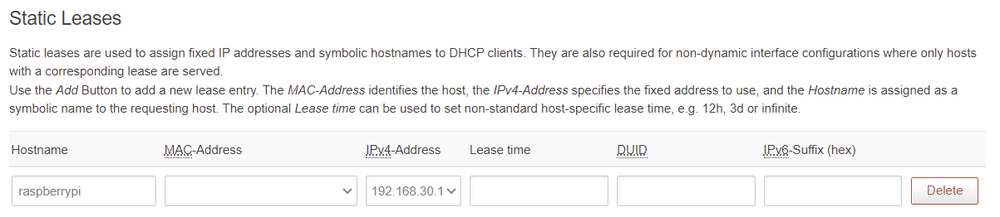

# Raspberry Pi VPN Server with Reverse Tunnel Setup

> **A comprehensive guide to set up a Raspberry Pi as a VPN server accessible via reverse SSH tunnel, without requiring router firewall modifications.**

## Overview

This project provides step-by-step instructions for:
- Setting up a Raspberry Pi as a local server
- Creating a reverse SSH tunnel to bypass firewall restrictions
- Installing and configuring PiVPN (OpenVPN) for secure remote access
- Optionally setting up an FTP server for file sharing

**Prerequisites:**
- A Raspberry Pi (any model with network connectivity)
- A remote server with a public IP address (for the reverse tunnel)
- Basic knowledge of SSH and command-line operations

**Before starting:** Update your Raspberry Pi to the latest version:
```bash
sudo apt-get update && sudo apt-get upgrade -y
```
---

## Part 1: Use Raspberry Pi as a Local Server

### 1. Find Raspberry Pi on Your Network

Use the hostname to discover your Raspberry Pi's IP address:
```bash
ping raspberrypi
# Or use the .local mDNS address
ping raspberrypi.local
```

**Alternative methods:**
- Check your router's DHCP client list
- Use a network scanner tool like `nmap` or `arp-scan`

**Result:** This will give you the local IP address (e.g., `192.168.1.100`)

### 2. SSH into Raspberry Pi

Connect to your Raspberry Pi via SSH:
```bash
ssh pi@192.168.xxx.xxx
```

**Note:** Replace `192.168.xxx.xxx` with your Raspberry Pi's actual IP address.

**Password:** Set up the password using Raspberry Pi Imager settings during initial setup.  


### 3. Update Raspberry Pi System

After logging in, update the system packages:
```bash
sudo apt-get update && sudo apt-get upgrade -y
```

**Why:** Ensures you have the latest security patches and bug fixes before proceeding.

### 4. Set Up SSH Key for Passwordless Login

**On your local machine (Windows PC):**

Generate an SSH key pair (if you don't have one already):
```bash
ssh-keygen
```

Copy your public key to the Raspberry Pi:
```bash
# Windows Command Prompt or PowerShell
scp %UserProfile%\.ssh\id_rsa.pub pi@192.168.xx.xx:/home/pi/.ssh/authorized_keys

# Linux/macOS
ssh-copy-id pi@192.168.xx.xx
```

**Note:** Replace `192.168.xx.xx` with your Raspberry Pi's IP address.

**Result:** You can now SSH into your Raspberry Pi without entering a password each time.

---

## Part 2: Getting Started with Repository Setup

### 1. Install Required Packages

Install necessary software on the Raspberry Pi:
```bash
sudo apt-get install git autossh wget -y
```

**Packages explained:**
- `git` - Version control system for cloning this repository
- `autossh` - Automatically restarts SSH tunnels if they disconnect
- `wget` - Download utility (may be useful for additional setup)

### 2. Generate SSH Key for Git Access

Create an SSH key pair on the Raspberry Pi (if not done already):
```bash
ssh-keygen -t rsa -b 4096 -C "your_email@example.com"
```

**Why:** This enables secure authentication with Git repositories without passwords.

### 3. Add SSH Key to Your Git Account

**Step 1:** Copy your public SSH key from Raspberry Pi to your local machine.

**On your local machine (Windows PC):**
```bash
scp pi@192.168.xxx.xxx:/home/pi/.ssh/id_rsa.pub %UserProfile%\.ssh\external_key.pub
```

**Note:** Replace `192.168.xxx.xxx` with your Raspberry Pi's IP address.

**Step 2:** Add the key to your Git hosting service:
- **GitHub:** Go to Settings → SSH and GPG keys → New SSH key
- **GitLab:** Go to Preferences → SSH Keys
- **Bitbucket:** Go to Personal settings → SSH keys

Paste the contents of `external_key.pub` into the key field.

### 4. Clone This Repository

Clone this repository to your Raspberry Pi via SSH:
```bash
git clone git@github.com:YOUR_USERNAME/raspberry_reverse_setup.git
cd raspberry_reverse_setup
```

**Note:** Replace the repository URL with your actual repository address.

### 5. Assign Static Local IP Address to Raspberry Pi

**Why:** A static IP ensures the Raspberry Pi always has the same local address, which is important for reliable VPN and SSH access.

**How:** This is typically configured in your router's DHCP settings:
1. Log into your router's admin interface
2. Find DHCP or LAN settings
3. Reserve/assign a static IP for your Raspberry Pi's MAC address



---

## Part 3: Setup Remote Server (Public-Facing Server)

**Purpose:** The remote server acts as a bridge, allowing you to access your Raspberry Pi from anywhere without opening ports on your home network.

**Requirements:** 
- A server with a public IP address (VPS, cloud instance, or dedicated server)
- SSH access to this server
- Ability to keep the reverse tunnel connection open

### 1. Copy SSH Key to Remote Server

Establish passwordless SSH access from Raspberry Pi to remote server:

**Method 1 (recommended):**
```bash
ssh-copy-id username@remote_host
```

**Method 2 (manual):**
```bash
cat ~/.ssh/id_rsa.pub | ssh username@remote_host 'cat >> .ssh/authorized_keys && echo "Key copied"'
```

**Note:** Replace `username` with your remote server username and `remote_host` with the server's public IP or hostname.

### 2. Verify Remote Server Connection

Log into your remote server to verify access:
```bash
ssh username@remote_host
```

**Result:** You should be able to log in without entering a password.

### 3. Check Listening Ports on Remote Server

View all ports currently in use:
```bash
sudo lsof -i -P -n | grep LISTEN
```

**Why:** This helps you identify available ports for your reverse tunnel and avoid conflicts. Choose an unused port number (e.g., above 10000) for your tunnel.

---

## Part 4: Setup Reverse SSH Tunnel on Raspberry Pi

**What is a reverse SSH tunnel?**  
A reverse SSH tunnel forwards a port from your Raspberry Pi through the remote server, making it accessible from the internet without opening ports in your home firewall.

### 1. Create Reverse Tunnel Script

Use the provided template to create your tunnel startup script:

```bash
# Navigate to the repository directory
cd /home/pi/raspberry_reverse_setup

# Copy the template
cp reverse_tunnel_template.txt start_tunnel.sh

# Edit the script to configure your ports and server
nano start_tunnel.sh
```

**Configuration:** Replace the placeholders in the script:
- `xxx` → Choose matching port numbers (e.g., 22 for SSH, or custom ports like 1194 for OpenVPN)
- `username@remote_host` → Your remote server credentials
- Example: `-R 10022:localhost:22` forwards Pi's SSH port to remote server's port 10022

**Security Note:** The template contains a placeholder IP address. Make sure to replace it with your actual remote server address.

### 2. Make Script Executable

Grant execution permissions to the script:
```bash
chmod u+x start_tunnel.sh
```

**Test the script manually first:**
```bash
./start_tunnel.sh
```

Then verify on the remote server that the port is listening (see Part 3, Step 3).

### 3. Configure Automatic Startup with Crontab

Set the tunnel to start automatically on boot:

```bash
crontab -e
```

Add this line at the end of the file:
```bash
@reboot /home/pi/raspberry_reverse_setup/start_tunnel.sh
```

**Save and exit:**
- If using nano: Press `Ctrl+X`, then `Y`, then `Enter`
- If using vim: Press `Esc`, type `:wq`, press `Enter`

**What this does:** The `@reboot` directive ensures the tunnel starts automatically whenever the Raspberry Pi boots up.

### 4. Reboot and Verify the Tunnel

Restart your Raspberry Pi:
```bash
sudo reboot
```

**After reboot, verify on the remote server:**
```bash
ssh username@remote_host
sudo lsof -i -P -n | grep LISTEN
```

**Expected result:** You should see your specified port(s) in the listening ports list.

**Troubleshooting:** If the port doesn't appear:
- Check the script for syntax errors: `cat start_tunnel.sh`
- View crontab logs: `grep CRON /var/log/syslog`
- Try rebooting the remote server as well
- Manually run the script to see error messages: `./start_tunnel.sh`

---

## Part 5: Setup VPN Service with PiVPN

**What is PiVPN?**  
PiVPN is an automated installer that sets up OpenVPN or WireGuard on your Raspberry Pi, turning it into a VPN server.

### 1. Install PiVPN

Download and run the PiVPN installer:
```bash
curl -L https://install.pivpn.io | bash
```

**Note:** This command downloads and executes the installation script. The process is interactive and will guide you through setup.

### 2. Configure PiVPN During Installation

Follow the on-screen installation wizard. **Important configuration notes:**

- **Protocol:** Choose **OpenVPN** (recommended for this setup)
- **Port type:** Most cloud providers use **TCP** ports, not UDP
  - If your remote server's firewall only allows TCP, select TCP
  - UDP is faster but may be blocked; TCP is more reliable through firewalls
- **Port number:** Use the **same port** you configured in the reverse tunnel (e.g., 1194)
- **DNS Provider:** Choose a public DNS provider (e.g., Google, Cloudflare, or OpenDNS)
- **Public IP/DNS:** Enter your remote server's hostname or IP address
  - Example format: `your-server.example.com` or `123.45.67.89`
  - **Security Warning:** The example DNS hostname in `piVPN_commands.txt` should be replaced with your own server address

**Configuration Summary:**
```
Protocol: OpenVPN
Port: 1194 (or your chosen port)
Protocol Type: TCP (or UDP if your server supports it)
DNS: Cloudflare (1.1.1.1) or Google (8.8.8.8)
Public Address: YOUR_REMOTE_SERVER_ADDRESS
```

### 3. Create OpenVPN Client Profile

Generate a VPN profile for your device:
```bash
pivpn add
```

**Setup:**
- Enter a name for the client (e.g., `laptop`, `phone`)
- Optionally set a password for additional security
- The `.ovpn` profile file will be created in `/home/pi/ovpns/`

**Transfer profile to your device:**

**On your local machine (Windows PC):**
```bash
scp pi@192.168.xxx.xxx:/home/pi/ovpns/CLIENTNAME.ovpn %UserProfile%\Downloads\
```

**On Linux/macOS:**
```bash
scp pi@192.168.xxx.xxx:/home/pi/ovpns/CLIENTNAME.ovpn ~/Downloads/
```

**Note:** Replace `192.168.xxx.xxx` with your Raspberry Pi's local IP and `CLIENTNAME` with the actual filename.

### 4. Test VPN Connection

**Setup on client device:**
1. Install OpenVPN client software:
   - **Windows/macOS:** [OpenVPN Connect](https://openvpn.net/client-connect-vpn-for-windows/)
   - **Linux:** `sudo apt-get install openvpn`
   - **iOS/Android:** OpenVPN Connect app from App Store/Play Store

2. Import the `.ovpn` profile file

3. Connect to the VPN

**Testing:**
1. Connect to a different network (e.g., mobile hotspot, coffee shop WiFi)
2. Activate your VPN connection through OpenVPN client
3. Try to SSH into your Raspberry Pi using its **local IP address**:
   ```bash
   ssh pi@192.168.xxx.xxx
   ```

**Expected result:** You should successfully connect to your Raspberry Pi as if you were on the same local network.

**Congratulations!** If this works, your VPN setup is complete and you can access your local network securely from anywhere in the world.

---

## Additional Commands and Management

### PiVPN Management Commands

```bash
# Add a new VPN client profile
pivpn add

# List all VPN clients
pivpn list

# Revoke a client's access
pivpn revoke

# Show connected clients
pivpn clients

# Uninstall PiVPN
pivpn uninstall
```

### Troubleshooting

**VPN won't connect:**
- Verify the reverse tunnel is running: `ps aux | grep autossh`
- Check remote server port forwarding: `ssh username@remote_host 'sudo lsof -i -P -n | grep LISTEN'`
- Verify OpenVPN service is running: `sudo systemctl status openvpn`
- Check firewall rules on remote server

**Can't access local network through VPN:**
- Verify IP forwarding is enabled: `cat /proc/sys/net/ipv4/ip_forward` (should return 1)
- Check iptables rules: `sudo iptables -L -v -n`
- Verify your VPN client is using the correct DNS settings

---

## Security Considerations

**Before Publishing This Repository:**

1. **Remove sensitive information:**
   - WiFi credentials in `wpa_supplicant.conf`
   - Server IP addresses and hostnames
   - Personal network information

2. **Use environment variables or configuration files:**
   - Create a `.env` or `config.txt` file (add to `.gitignore`)
   - Document required variables in README

3. **Update the reverse tunnel template:**
   - Replace hardcoded IP addresses with placeholders
   - Add clear instructions for customization

4. **Review all files** for any personal identifiers or sensitive data

---

## License

This project is licensed under the MIT License. 

## Contributing

Contributions are welcome! Please feel free to submit a Pull Request.

## Acknowledgments

- [PiVPN](https://pivpn.io/) - The simple OpenVPN/WireGuard installer
- [AutoSSH](https://www.harding.motd.ca/autossh/) - Automatic SSH tunnel management

